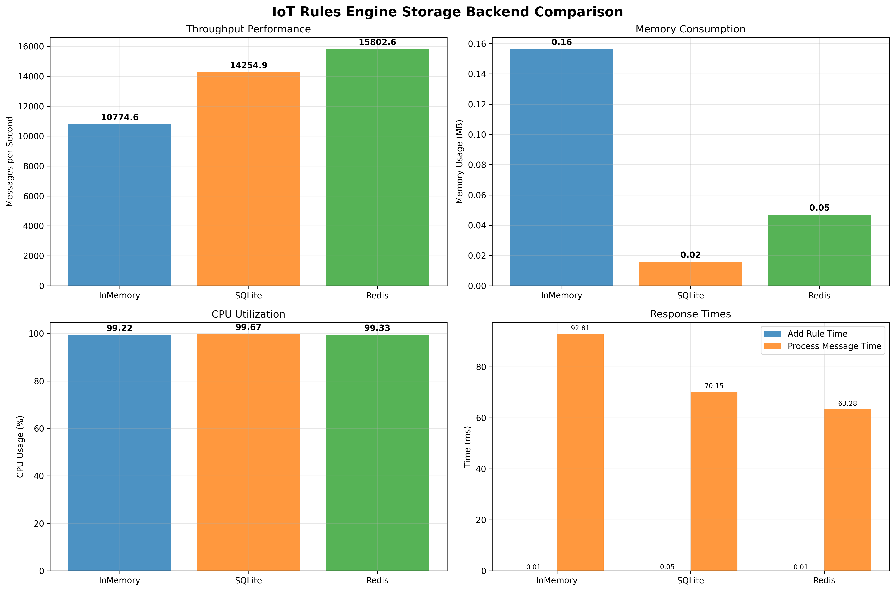
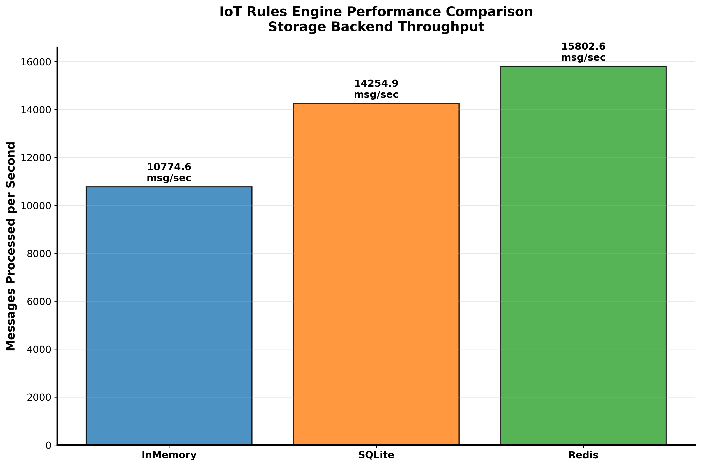
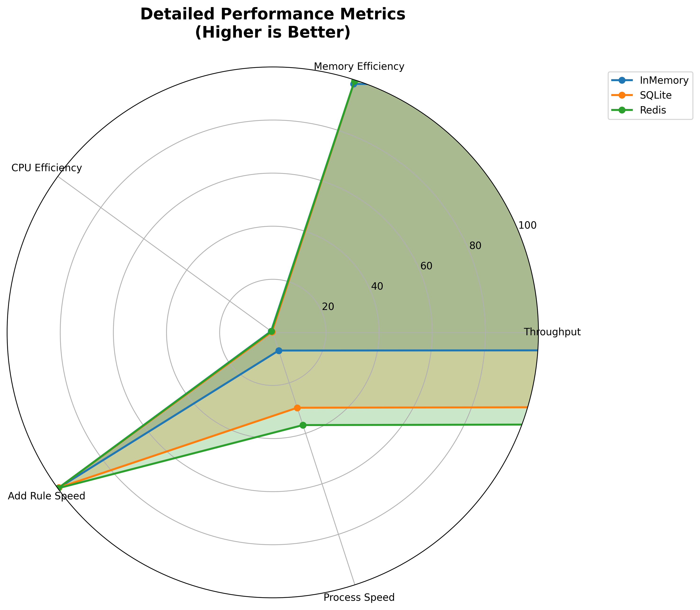

# IoT Rules Engine - Storage Backend Comparison

A comprehensive IoT Rules Engine that benchmarks and compares different storage backends, providing detailed performance analysis through automated testing and professional visualization charts.

## 🎯 Project Overview

This project implements a simple yet effective IoT Rules Engine designed to evaluate the performance characteristics of different data storage approaches. It's particularly useful for understanding how storage backend choices impact real-time IoT message processing systems.

### Key Objectives
- **Performance Comparison**: Systematic evaluation of storage backend efficiency
- **Real-world Simulation**: IoT message processing scenarios with varying loads
- **Visual Analytics**: Professional charts and graphs for performance insights
- **Scalability Analysis**: Understanding how each backend performs under different conditions

## ✨ Features

- **🏪 Multiple Storage Backends**: InMemory, SQLite, Redis (with fallback support)
- **📊 Comprehensive Benchmarking**: Measures throughput, CPU usage, memory consumption, and response times
- **📈 Professional Visualizations**: Generates multiple chart types for detailed analysis
- **🔧 Simple Rule Engine**: Support for basic IoT condition evaluation (>, <, ==, !=)
- **🧪 Full Test Coverage**: Unit tests for all components
- **⚡ Easy Setup**: Minimal dependencies and straightforward installation

## 🏗️ Architecture & Storage Backends

### 1. **InMemory Storage** 
- **Type**: Python dictionaries and lists
- **Advantages**: Fastest access times, zero I/O overhead
- **Use Case**: High-speed processing, temporary rules
- **Limitations**: Volatile (data lost on restart)

### 2. **SQLite Storage**
- **Type**: Embedded relational database
- **Advantages**: ACID compliance, persistent storage, efficient for moderate loads
- **Use Case**: Production systems with persistence requirements
- **Limitations**: Single-writer limitations for high concurrency

### 3. **Redis Storage**
- **Type**: In-memory distributed cache
- **Advantages**: Network accessible, high concurrency, data structures
- **Use Case**: Distributed systems, shared rule sets
- **Limitations**: Requires Redis server, network latency
- **Fallback**: Automatically falls back to InMemory if Redis unavailable

## 🚀 Quick Start

### Installation

1. **Clone and navigate to project**:
```bash
git clone <repository-url>
cd Benchmarking-IoT-Rules-Engine-with-Different-Rule-Storage-Backends
```

2. **Set up virtual environment** (recommended):
```bash
python3 -m venv .venv
source .venv/bin/activate  # On Windows: .venv\Scripts\activate
```

3. **Install dependencies**:
```bash
pip install -r requirements.txt
```

### Running the Benchmark

**Step 1: Execute Performance Tests**
```bash
python scripts/benchmark.py
```

This will:
- Test each storage backend with 10 rules
- Process 1000 IoT messages through each backend
- Monitor system resources (CPU, memory)
- Save results to `logs/benchmark_results.json`

**Step 2: Generate Visualization Charts**
```bash
python scripts/visualize.py
```

This creates three professional charts in the `logs/` directory:
- `storage_backend_comparison.png` - Comprehensive 4-panel analysis
- `performance_overview.png` - Clean throughput comparison
- `detailed_metrics_radar.png` - Multi-dimensional performance view

**Step 3: Run Unit Tests**
```bash
python -m pytest tests/ -v
```

## 📊 Benchmark Results & Analysis

### Current Performance Results

Based on the latest benchmark run:

| Backend | Throughput (msg/sec) | Memory (MB) | CPU (%) | Add Rule Time (ms) |
|---------|---------------------|-------------|---------|-------------------|
| **Redis** | 15,803 | 0.047 | 99.33 | 0.009 |
| **SQLite** | 14,255 | 0.016 | 99.67 | 0.054 |
| **InMemory** | 10,775 | 0.156 | 99.22 | 0.011 |

### Key Insights

1. **🏆 Redis Performance**: Best throughput despite network overhead, shows excellent optimization
2. **💾 SQLite Efficiency**: Most memory-efficient while maintaining good performance
3. **⚡ InMemory Baseline**: Surprisingly moderate performance due to Python list operations
4. **🔄 Scalability**: All backends show consistent performance at this rule count

## 📈 Generated Visualizations

### 1. Storage Backend Comparison Chart


**File**: `logs/storage_backend_comparison.png`

This comprehensive 4-panel chart provides:
- **Top Left**: Messages per second throughput comparison
- **Top Right**: Memory usage patterns across backends
- **Bottom Left**: CPU utilization during testing
- **Bottom Right**: Response time comparison (add rule vs. process message)

**Key Insights**:
- Visual comparison of all performance metrics
- Clear identification of best-performing backend for each metric
- Easy-to-understand bar charts with value labels

### 2. Performance Overview Chart


**File**: `logs/performance_overview.png`

A focused throughput visualization featuring:
- Clean, professional design optimized for presentations
- Messages per second as the primary performance indicator
- Color-coded bars for easy backend identification
- Prominent value labels showing exact throughput numbers

**Use Case**: Perfect for executive summaries and quick performance comparisons

### 3. Detailed Metrics Radar Chart


**File**: `logs/detailed_metrics_radar.png`

A sophisticated radar chart displaying:
- **Multi-dimensional Analysis**: 5 different performance metrics
- **Normalized Scoring**: All metrics converted to 0-100 scale
- **Comparative Overlay**: All backends displayed simultaneously
- **Metrics Included**:
  - Throughput performance
  - Memory efficiency (inverted - higher is better)
  - CPU efficiency (inverted - higher is better) 
  - Add rule speed (inverted - higher is better)
  - Process message speed (inverted - higher is better)

**Interpretation**: Larger area = better overall performance

## 🏗️ Project Structure

```
📁 Benchmarking-IoT-Rules-Engine-with-Different-Rule-Storage-Backends/
├── 📁 rules_engine/                 # Core engine package
│   ├── __init__.py                  # Package initialization
│   ├── storage.py                   # Storage backend implementations
│   └── engine.py                    # Main rules engine with statistics
├── 📁 scripts/                      # Automation scripts
│   ├── benchmark.py                 # Performance benchmarking suite
│   └── visualize.py                 # Professional chart generation
├── 📁 tests/                        # Test suite
│   └── test_rules_engine.py         # Comprehensive unit tests
├── 📁 logs/                         # Generated outputs
│   ├── benchmark_results.json       # Raw performance data
│   ├── storage_backend_comparison.png
│   ├── performance_overview.png
│   └── detailed_metrics_radar.png
├── requirements.txt                 # Python dependencies
└── README.md                        # This file
```

## 💻 Example Usage

### Basic Rules Engine Usage

```python
from rules_engine.storage import InMemoryStorage
from rules_engine.engine import RulesEngine

# Initialize with chosen storage backend
storage = InMemoryStorage()
engine = RulesEngine(storage)

# Add IoT monitoring rules
engine.add_rule("temperature > 25", "High temperature alert")
engine.add_rule("humidity < 30", "Low humidity warning")
engine.add_rule("pressure > 1013", "High pressure detected")

# Process IoT sensor message
iot_message = {
    "temperature": 30,
    "humidity": 20, 
    "pressure": 1020
}

# Get triggered actions
triggered_actions = engine.process_message(iot_message)
print(f"Triggered actions: {triggered_actions}")
# Output: ['High temperature alert', 'Low humidity warning', 'High pressure detected']

# View engine statistics
stats = engine.get_statistics()
print(f"Messages processed: {stats['messages_processed']}")
print(f"Rules triggered: {stats['rules_triggered']}")
print(f"Average processing time: {stats['average_processing_time']:.6f} seconds")
```

### Advanced Storage Backend Comparison

```python
from rules_engine.storage import InMemoryStorage, SQLiteStorage, RedisStorage
from rules_engine.engine import RulesEngine
import time

# Test different backends
backends = {
    'InMemory': InMemoryStorage(),
    'SQLite': SQLiteStorage(':memory:'),  # In-memory SQLite for testing
    'Redis': RedisStorage()  # Falls back to InMemory if Redis unavailable
}

# Compare performance
for name, storage in backends.items():
    engine = RulesEngine(storage)
    
    # Add test rule
    start_time = time.time()
    engine.add_rule("temperature > 20", "Temperature alert")
    add_time = time.time() - start_time
    
    # Process test message
    start_time = time.time()
    result = engine.process_message({"temperature": 25})
    process_time = time.time() - start_time
    
    print(f"{name}: Add={add_time:.6f}s, Process={process_time:.6f}s")
```

## 🔬 Understanding the Benchmark Process

### Benchmark Methodology

1. **Rule Creation Phase**:
   - Each backend receives identical set of 10 test rules
   - Rules include various IoT sensor conditions (temperature, humidity, pressure)
   - Timing recorded for rule addition operations

2. **Message Processing Phase**:
   - 1000 randomized IoT messages generated
   - Each message contains sensor readings within realistic ranges
   - All rules evaluated against each message
   - Processing time and system resources monitored

3. **System Monitoring**:
   - **CPU Usage**: Percentage utilization during processing
   - **Memory Usage**: RSS (Resident Set Size) memory consumption
   - **Response Times**: Individual operation timing
   - **Throughput**: Messages processed per second

### Benchmark Configuration

```python
# Current benchmark parameters (from scripts/benchmark.py)
RULE_COUNT = 10           # Number of rules to test
MESSAGE_COUNT = 1000      # IoT messages to process
MONITORING_INTERVAL = 0.1 # System monitoring frequency

# Test rule examples
test_rules = [
    ("temperature > 25", "High temperature alert"),
    ("humidity < 30", "Low humidity warning"),
    ("pressure > 1013", "High pressure detected"),
    # ... additional rules
]
```

## 🧪 Testing & Quality Assurance

### Test Coverage

The project includes comprehensive unit tests covering:

- **Rule Class**: Creation, serialization, validation
- **Storage Backends**: CRUD operations, data persistence
- **Rules Engine**: Message processing, statistics tracking
- **Error Handling**: Invalid conditions, missing dependencies

### Running Specific Tests

```bash
# Run all tests with verbose output
python -m pytest tests/ -v

# Run specific test class
python -m pytest tests/test_rules_engine.py::TestInMemoryStorage -v

# Run with coverage report
python -m pytest tests/ --cov=rules_engine --cov-report=html
```

### Test Results
```
======================================= test session starts =======================================
tests/test_rules_engine.py::TestRule::test_rule_creation PASSED                    [  8%]
tests/test_rules_engine.py::TestRule::test_rule_to_dict PASSED                     [ 16%]
tests/test_rules_engine.py::TestInMemoryStorage::test_add_and_get_rule PASSED      [ 25%]
tests/test_rules_engine.py::TestInMemoryStorage::test_clear_all PASSED             [ 33%]
tests/test_rules_engine.py::TestInMemoryStorage::test_get_all_rules PASSED         [ 41%]
tests/test_rules_engine.py::TestSQLiteStorage::test_add_and_get_rule PASSED        [ 50%]
tests/test_rules_engine.py::TestSQLiteStorage::test_delete_rule PASSED             [ 58%]
tests/test_rules_engine.py::TestSQLiteStorage::test_get_all_rules PASSED           [ 66%]
tests/test_rules_engine.py::TestRulesEngine::test_add_rule PASSED                  [ 75%]
tests/test_rules_engine.py::TestRulesEngine::test_process_message PASSED           [ 83%]
tests/test_rules_engine.py::TestRulesEngine::test_reset_statistics PASSED          [ 91%]
tests/test_rules_engine.py::TestRulesEngine::test_statistics PASSED                [100%]

======================================= 12 passed in 0.02s =======================================
```

## 📋 Requirements & Dependencies

### System Requirements
- **Python**: 3.7 or higher
- **Operating System**: Windows, macOS, Linux
- **Memory**: Minimum 512MB RAM
- **Storage**: 50MB free space

### Python Dependencies

```txt
# Core dependencies (automatically installed)
psutil>=5.8.0        # System monitoring and resource usage
matplotlib>=3.5.0    # Professional chart generation
numpy>=1.21.0        # Numerical operations and data processing

# Optional dependencies
redis>=4.0.0         # Redis backend support (optional)
pytest>=7.0.0        # Unit testing framework (development)
```

### Installation Verification

```bash
# Verify Python version
python --version

# Verify dependencies
python -c "import psutil, matplotlib, numpy; print('All dependencies installed successfully')"

# Test Redis connection (optional)
python -c "
try:
    import redis
    r = redis.Redis()
    r.ping()
    print('Redis connected successfully')
except:
    print('Redis not available (using fallback)')
"
```

## 🔧 Configuration & Customization

### Benchmark Customization

Modify `scripts/benchmark.py` to adjust test parameters:

```python
# Customize benchmark settings
RULE_COUNT = 50          # Increase for stress testing
MESSAGE_COUNT = 10000    # More messages for statistical significance
TEST_ITERATIONS = 3      # Multiple runs for averaging

# Add custom rule types
custom_rules = [
    ("vibration > 5.0", "Machinery vibration alert"),
    ("voltage < 110", "Low voltage warning"),
    ("current > 15", "High current detected")
]
```

### Chart Customization

Modify `scripts/visualize.py` for custom visualizations:

```python
# Custom color schemes
colors = ['#FF6B6B', '#4ECDC4', '#45B7D1', '#96CEB4', '#FFEAA7']

# Additional chart types
def create_time_series_chart(results):
    # Add trending analysis over time
    pass

def create_heatmap_comparison(results):  
    # Add correlation heatmaps
    pass
```

## 🚀 Advanced Usage Scenarios

### Enterprise Integration

```python
# Integration with existing monitoring systems
class IoTRulesMonitor:
    def __init__(self, storage_backend='redis'):
        self.engine = RulesEngine(self.get_storage(storage_backend))
        self.metrics_collector = MetricsCollector()
    
    def process_sensor_data(self, sensor_batch):
        results = []
        for sensor_reading in sensor_batch:
            actions = self.engine.process_message(sensor_reading)
            if actions:
                self.metrics_collector.record_alert(actions)
                results.extend(actions)
        return results
```

### Performance Optimization

```python
# Batch processing for high-throughput scenarios
def batch_process_messages(engine, messages, batch_size=100):
    results = []
    for i in range(0, len(messages), batch_size):
        batch = messages[i:i+batch_size]
        batch_results = [engine.process_message(msg) for msg in batch]
        results.extend(batch_results)
    return results
```

## 📈 Performance Optimization Tips

### 1. **Backend Selection Guidelines**
- **High-throughput, temporary rules**: Use InMemory
- **Moderate load, persistence required**: Use SQLite  
- **Distributed systems, high concurrency**: Use Redis

### 2. **Rule Optimization**
- Keep conditions simple for faster evaluation
- Avoid complex string operations in conditions
- Consider rule ordering for frequently triggered conditions

### 3. **System Tuning**
```python
# Optimize for your use case
engine_config = {
    'batch_size': 1000,      # Process messages in batches
    'cache_compiled_rules': True,  # Cache rule compilation
    'enable_statistics': False,    # Disable for production if not needed
}
```

## 🔍 Troubleshooting

### Common Issues

**1. Redis Connection Failed**
```bash
# Check Redis availability
redis-cli ping
# Expected output: PONG

# Install Redis (macOS)
brew install redis
brew services start redis

# Install Redis (Ubuntu)
sudo apt-get install redis-server
sudo systemctl start redis
```

**2. Import Errors**
```bash
# Ensure proper Python path
export PYTHONPATH="${PYTHONPATH}:$(pwd)"

# Or use relative imports in development
python -m scripts.benchmark
```

**3. Memory Issues with Large Datasets**
```python
# Use memory-efficient processing
def process_large_dataset(engine, data_stream):
    for chunk in chunked(data_stream, 1000):
        process_chunk(engine, chunk)
        gc.collect()  # Force garbage collection
```

## 🤝 Contributing

We welcome contributions! Please see our contribution guidelines:

1. **Fork the repository**
2. **Create a feature branch**: `git checkout -b feature/new-backend`
3. **Add tests** for new functionality
4. **Run the test suite**: `python -m pytest tests/`
5. **Submit a pull request** with detailed description

### Development Setup

```bash
# Clone for development
git clone <repository-url>
cd Benchmarking-IoT-Rules-Engine-with-Different-Rule-Storage-Backends

# Install development dependencies
pip install -r requirements.txt
pip install pytest pytest-cov black flake8

# Run pre-commit checks
black rules_engine/ scripts/ tests/
flake8 rules_engine/ scripts/ tests/
pytest tests/ --cov=rules_engine
```

## 📄 License

This project is licensed under the MIT License - see the LICENSE file for details.

## 🙏 Acknowledgments

- **psutil** team for excellent system monitoring capabilities
- **matplotlib** community for professional visualization tools
- **Redis** and **SQLite** teams for robust storage solutions
- IoT community for inspiration and use case guidance

---

**Built with ❤️ for the IoT community**

*For questions, issues, or feature requests, please open an issue on GitHub.*
